

# PA4 Submission: TaskFlow Pipeline

Copy this file to <code style="color:#111827;background:#ddd6fe;padding:2px 4px;border-radius:4px;">SUBMISSION.md</code>. Put every screenshot in <code style="color:#111827;background:#ddd6fe;padding:2px 4px;border-radius:4px;">docs/</code>, embed it under the correct task, and write a short description below each image explaining what it proves. The grader should not need any file outside this repository.

## Student Information

| Field | Value |
|---|---|
| Name | Mahad bin Aamir |
| Roll Number | 26100249 |
| GitHub Repository URL | https://github.com/xylicblue/CS487-PA4 |
| Resource Group | `rg-sp26-26100249` |
| Assigned Region | uk-west |

## Evidence Rules

- Use relative image paths, for example: ``.
- Every image must have a 1-3 sentence description below it.
- Azure Portal screenshots must show the resource name and enough page context to identify the service.
- CLI screenshots must show the command and output.
- Mask secrets such as function keys, ACR passwords, and storage connection strings.

## Task 1: App Service Web App (15 points)

### Evidence 1.1: Forked Repository

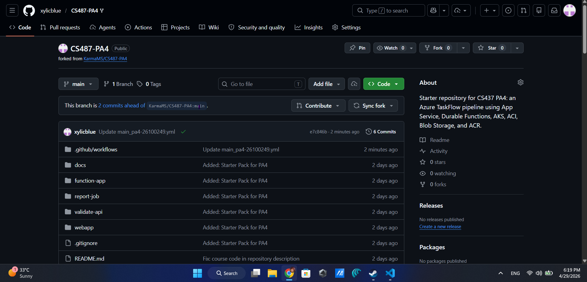

This is the working fork of the PA4 starter at `https://github.com/xylicblue/CS487-PA4`. It contains the full PA4 structure including the webapp, function-app, validate-api, and report-job directories.

### Evidence 1.2: App Service Overview

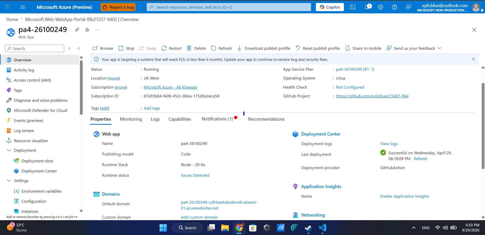

Web App `pa4-26100249` running on B1 Linux App Service Plan in UK West, serving the TaskFlow frontend at `https://pa4-26100249.azurewebsites.net`.

### Evidence 1.3: Deployment Center / GitHub Actions

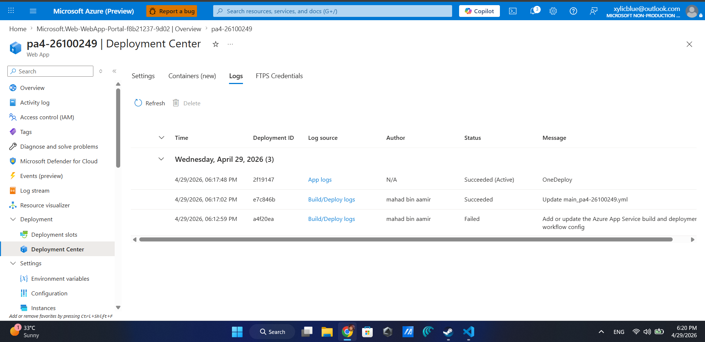
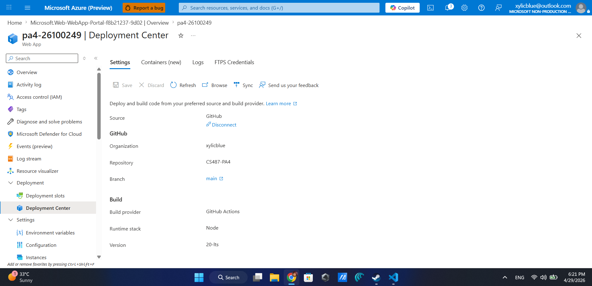

Deployment Center connected to the GitHub fork via GitHub Actions, automatically deploying on every push to the main branch. The workflow builds and deploys the Node.js web app to App Service.

### Application settings configured
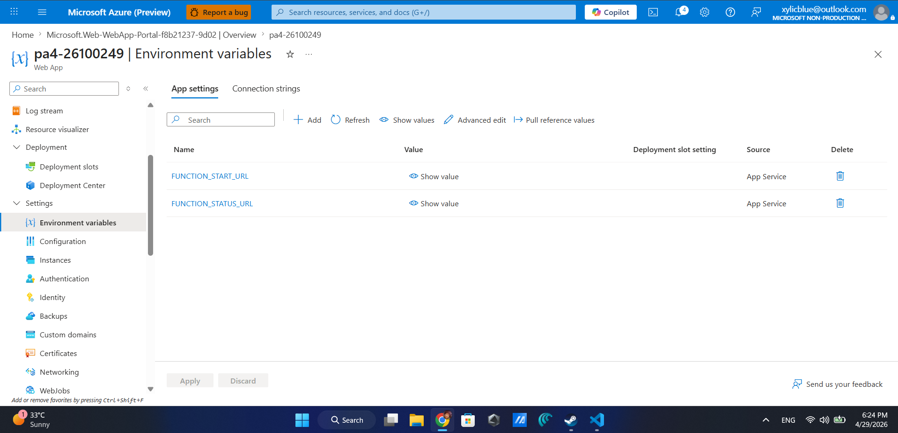

`FUNCTION_START_URL` and `FUNCTION_STATUS_URL` are configured as application settings so the frontend knows where to submit orders and poll orchestration status.

### Evidence 1.4: Live Web UI

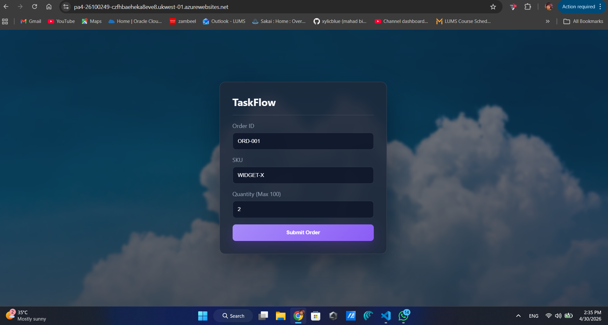

The TaskFlow order submission UI is live and publicly accessible at `https://pa4-26100249.azurewebsites.net`. The page loads the order form served directly from the App Service.

---

## Task 2: Azure Container Registry (15 points)

### Evidence 2.1: ACR Overview

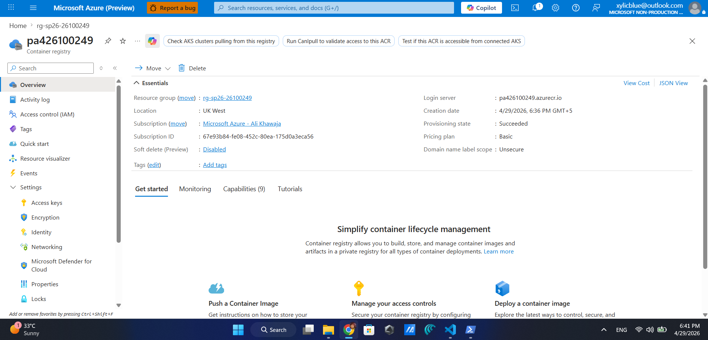

ACR `pa426100249` (Basic SKU) provisioned in resource group `rg-sp26-26100249`, UK West. It serves as the private registry for all three container images used in this pipeline.

### Evidence 2.2: Docker Builds

### Local Container Running:
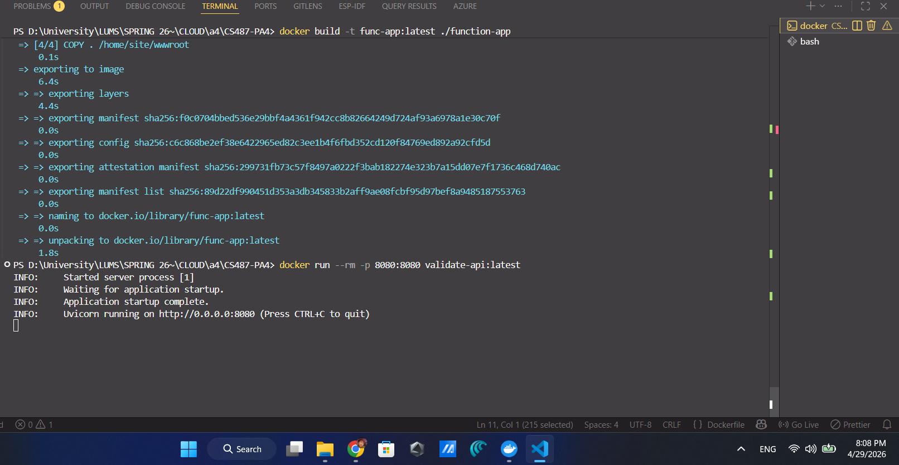

# Building images locally:
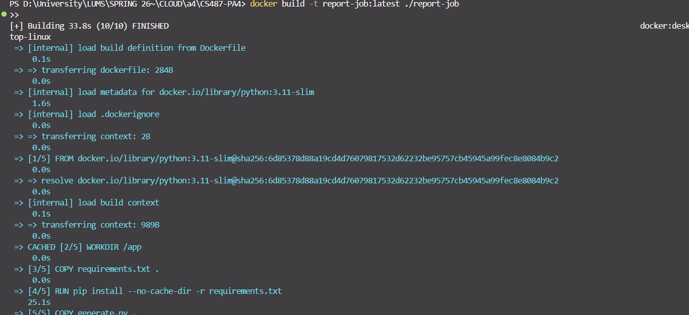
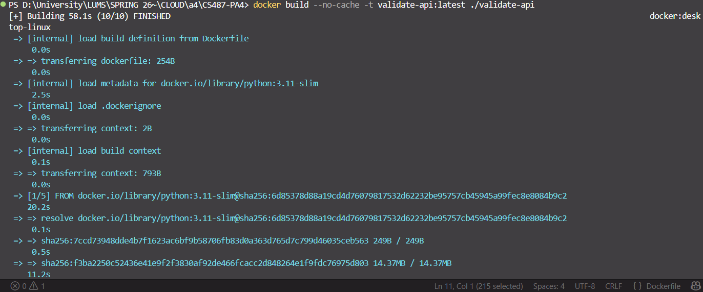
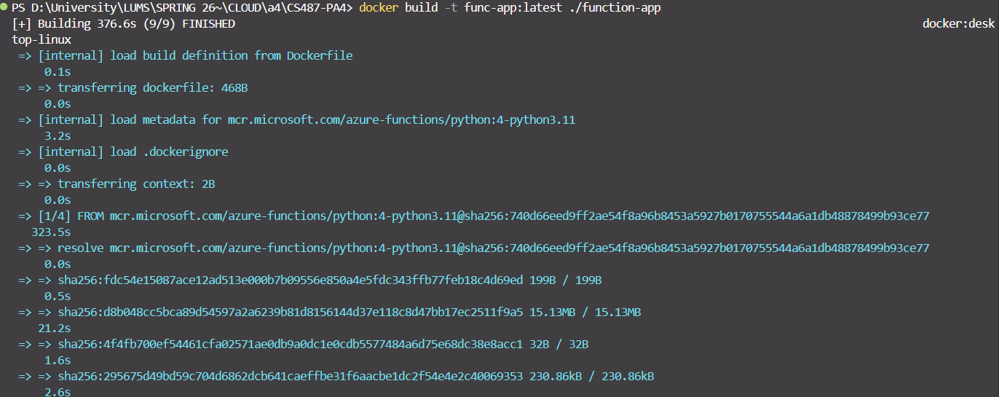

All three images were built locally using Docker: `validate-api:v1` (from `validate-api/`), `report-job:v1` (from `report-job/`), and `func-app:v1` (from `function-app/`).

### Local validator Test:
<!--  -->
Response:
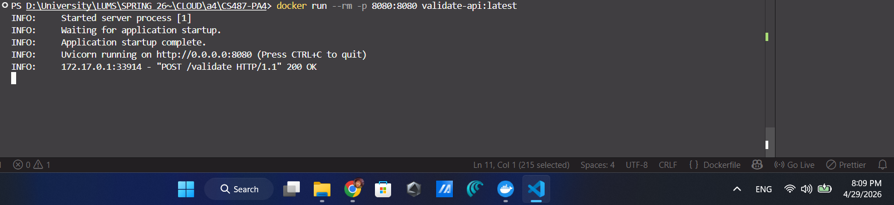
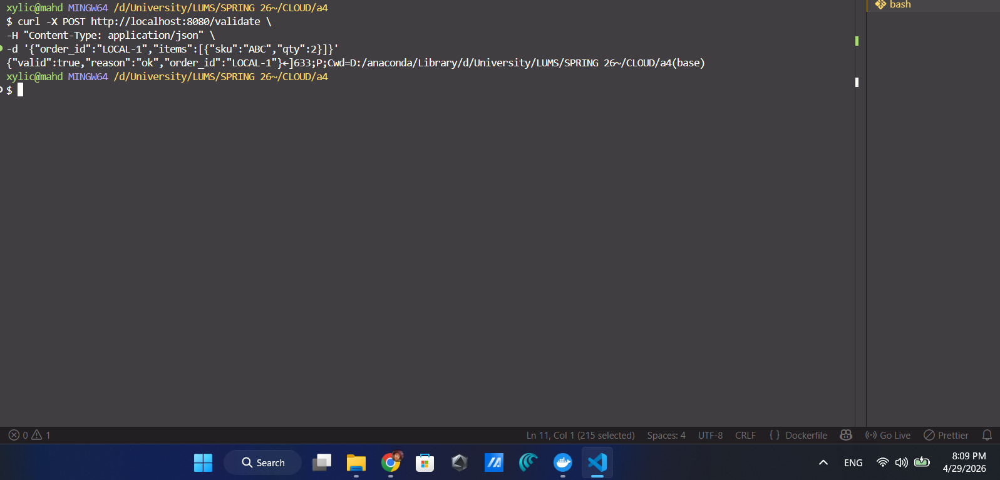
The validate-api container was tested locally by sending a POST to `/validate`. The response confirms the validation logic correctly evaluates order items.

### Pushing images to ACR:
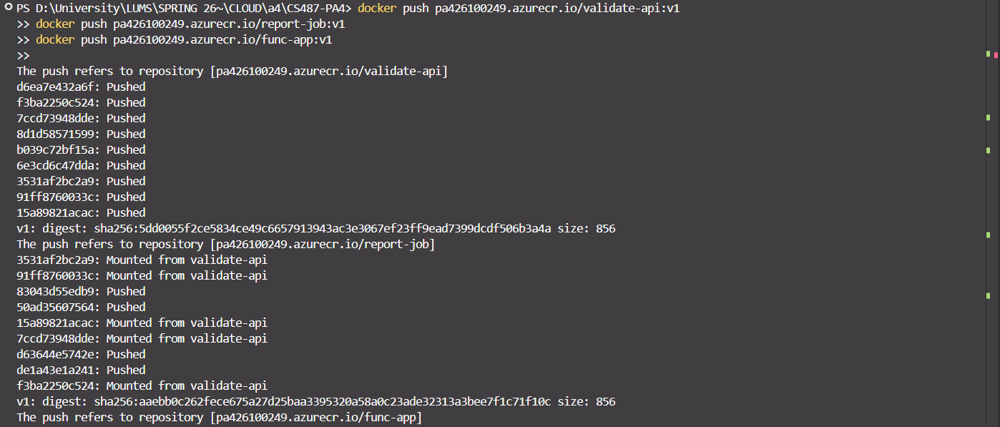
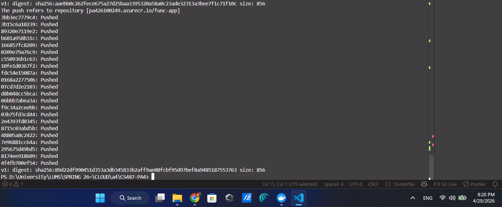

All three images were tagged and pushed to `pa426100249.azurecr.io` using `docker push` after authenticating with `az acr login`.

### Evidence 2.3: ACR Repositories

### Terminal:
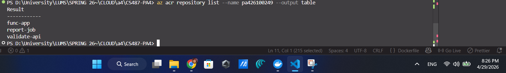
### Azure GUI:
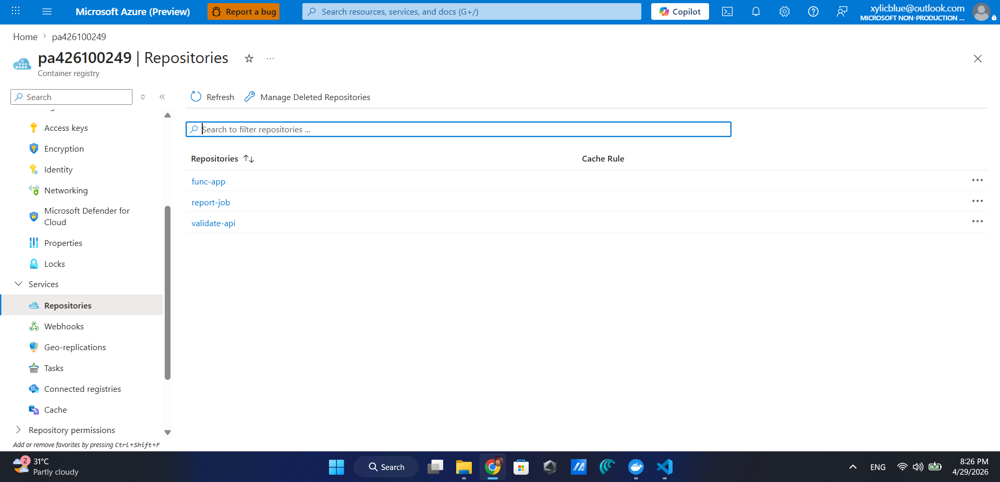

All three repositories are present in ACR: `validate-api:v1`, `report-job:v1`, and `func-app:v1`, confirming successful pushes from the local build.

---

## Task 3: Durable Function Implementation (12 points)

### Evidence 3.1: Completed Function Code

`[function_app.py](function-app/function_app.py)`

The orchestrator chains `validate_activity` (POSTs the order to the AKS validator at `VALIDATE_URL`) → if invalid, returns a `rejected` status immediately with no further action; if valid, calls `report_activity` which spawns an ACI container to generate the PDF and upload it to blob storage, then returns the blob URL as `report_url`.

### Evidence 3.2: Local Function Handler Listing

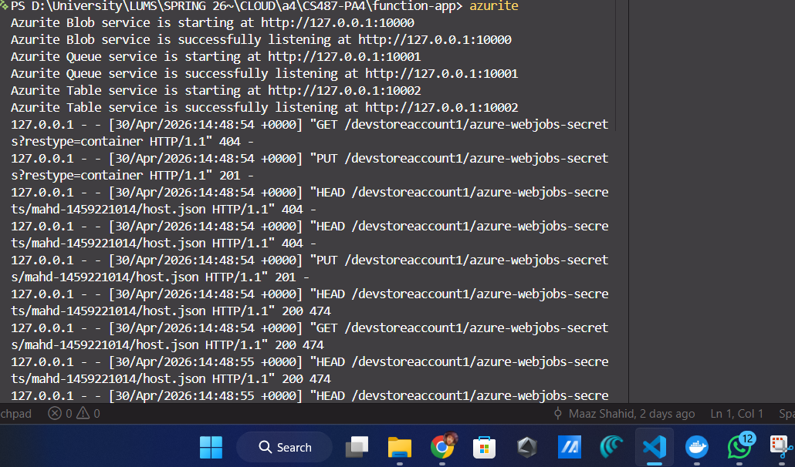
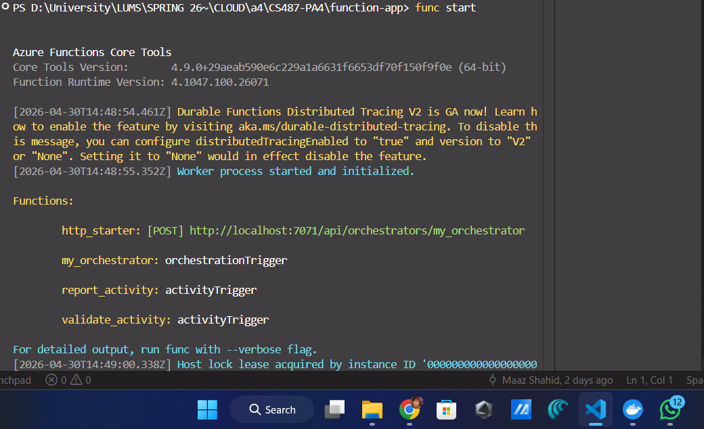

The `func start` output shows the Durable Functions runtime successfully discovered all four handlers: `http_starter` (HTTP trigger), `my_orchestrator` (orchestration trigger), `validate_activity`, and `report_activity` (activity triggers), confirming the implementation is correctly wired.

### Evidence 3.3: Smoke Test:
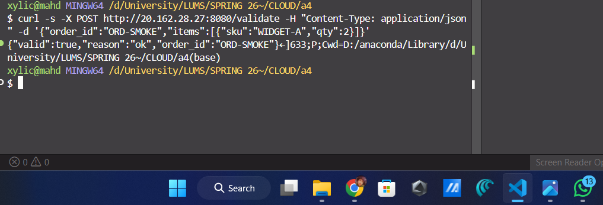

---

## Task 4: Function App Container Deployment (8 points)

### Evidence 4.1: Function App Container Configuration

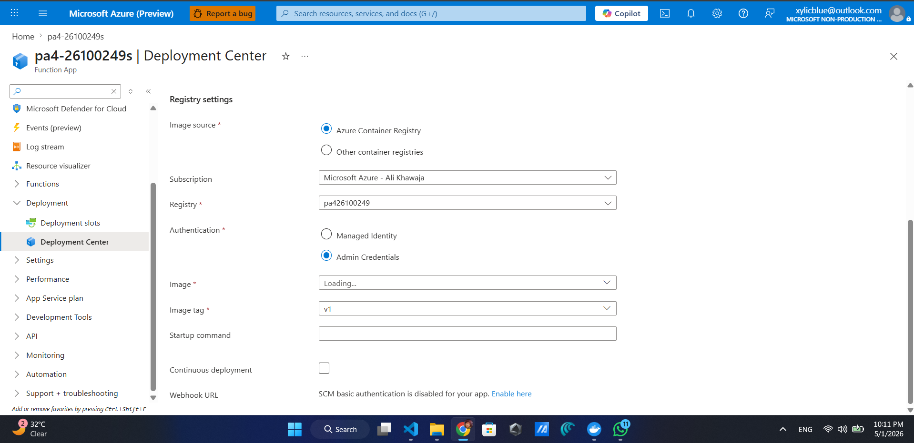

Function App `pa4-26100249s` deployed as a container using image `pa426100249.azurecr.io/func-app:v1` on a B1 Linux App Service Plan in UK West.

### Function list showing all deployed functions:
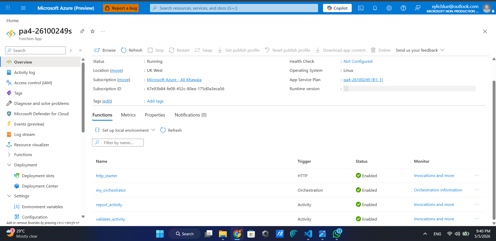

The Azure Portal confirms all four functions are registered and enabled in the deployed Function App: `http_starter`, `my_orchestrator`, `validate_activity`, and `report_activity`.

<!-- ### Evidence 4.2: Orchestration Smoke Test

The Function App HTTP starter was tested with a `curl` POST to `/api/orchestrators/my_orchestrator`. It returned HTTP 202 with an `id` and `statusQueryGetUri`, confirming the Durable Functions runtime accepted the orchestration and persisted its state to storage.

### Evidence 4.3: Expected Failed Status Before Downstream Wiring

Before `VALIDATE_URL` was configured as an app setting, the `validate_activity` would fail with an environment variable error. This failure is expected at this stage because the activity function depends on `VALIDATE_URL` to reach the AKS validator, which had not yet been deployed. The orchestration correctly surfaces the activity failure as a `Failed` orchestration status. -->

---

## Task 5: AKS Validator (15 points)

### Evidence 5.1: AKS Cluster

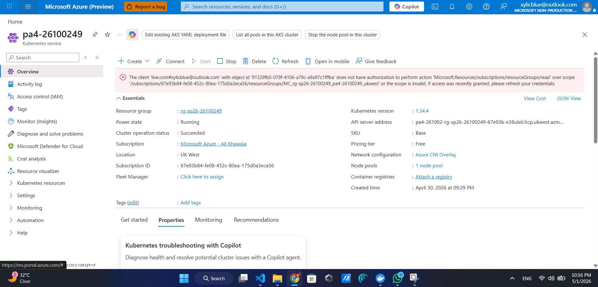

AKS cluster `pa4-26100249` provisioned successfully in UK West, resource group `rg-sp26-26100249`. It runs 1 node pool with 1 node of size `Standard_B2s`.

### Evidence 5.2: Kubernetes Nodes and Pods

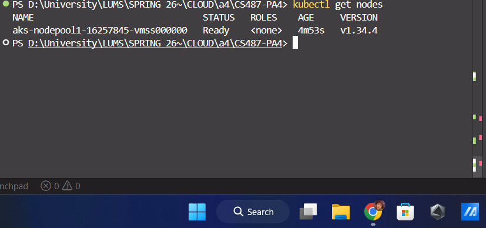
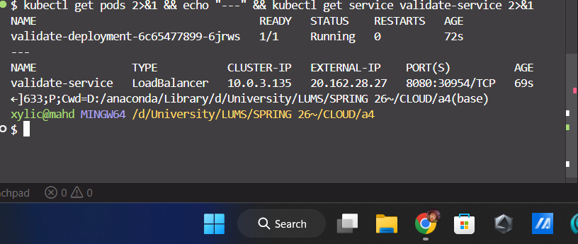

`kubectl get nodes` shows the node in `Ready` state. `kubectl get pods` confirms the `validate-deployment` pod is `1/1 Running`, meaning the validator container is healthy and serving traffic.

### Evidence 5.3: Kubernetes Service

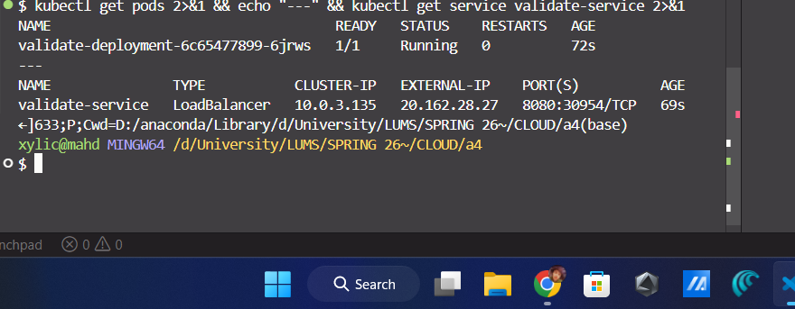

The `validate-service` LoadBalancer exposes the validator at external IP `20.162.28.27` on port `8080`. This IP is used as the `VALIDATE_URL` in the Function App.

### Evidence 5.4: Validator API Tests

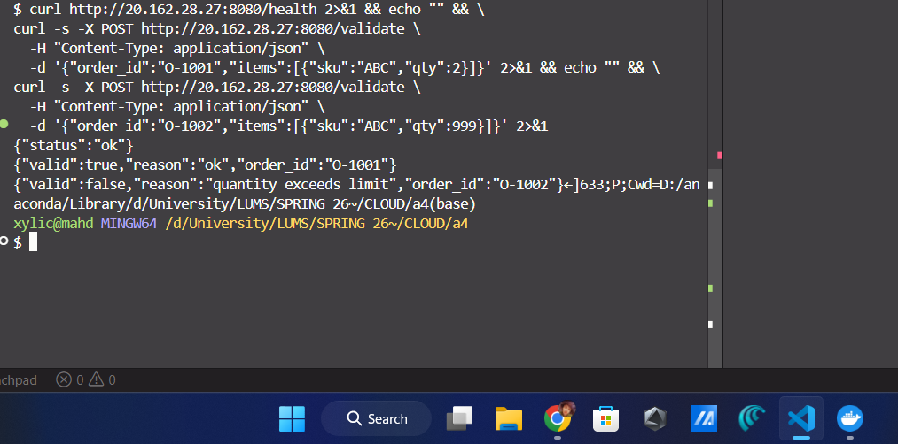

Valid orders (qty≤100) return `{"valid": true, "reason": "ok"}`. Orders with any item having qty>100 return `{"valid": false}`. This rejection logic is enforced by the AKS-hosted validator before any report ACI is spawned.

### Evidence 5.5: Function App `VALIDATE_URL`

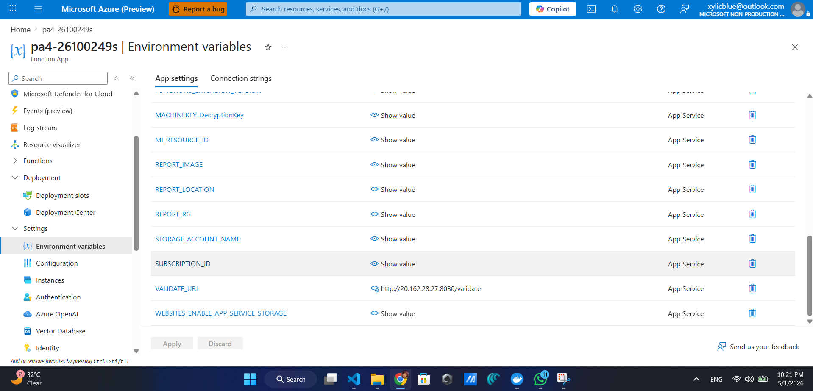
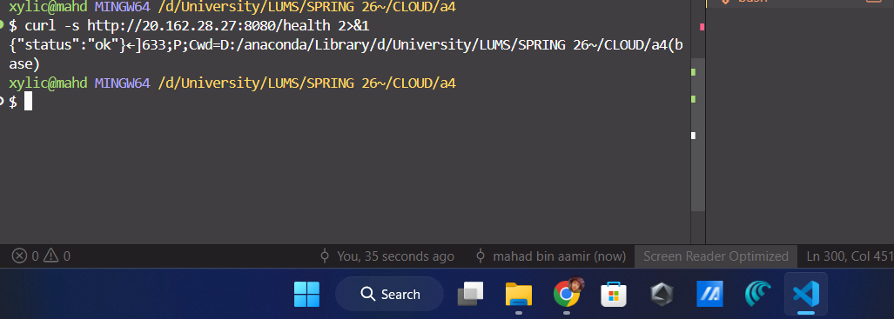

The Function App has `VALIDATE_URL=http://20.162.28.27:8080/validate` configured as an application setting. The `validate_activity` function reads this at runtime and POSTs the order payload to the AKS validator.

### Evidence 5.6: AKS Idle Behavior

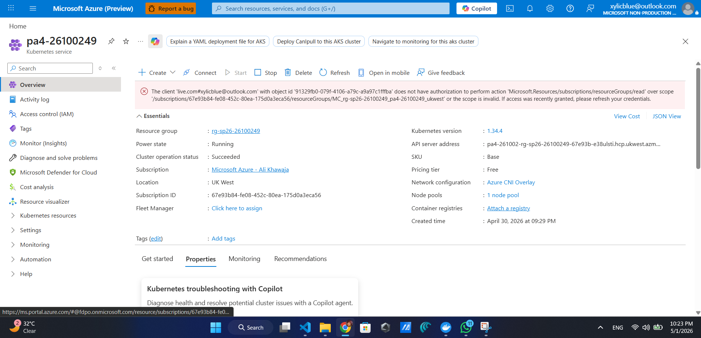

The AKS node pool remains running continuously even when no orders are being processed. Unlike ACI, AKS does not scale to zero — the node incurs a fixed hourly cost regardless of traffic, which is acceptable for the always-on validator role.

---

## Task 6: ACI Report Job (15 points)

### Evidence 6.1: Blob Container

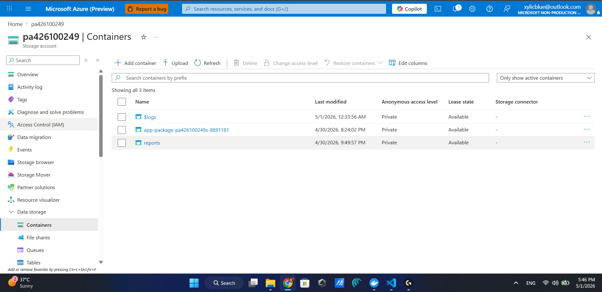

Generated PDFs are stored in the `reports` blob container inside the `pa426100249` storage account. Each file is named `<order_id>.pdf` and is uploaded by the ACI report job using Managed Identity authentication.

### Evidence 6.2: Manual ACI Run

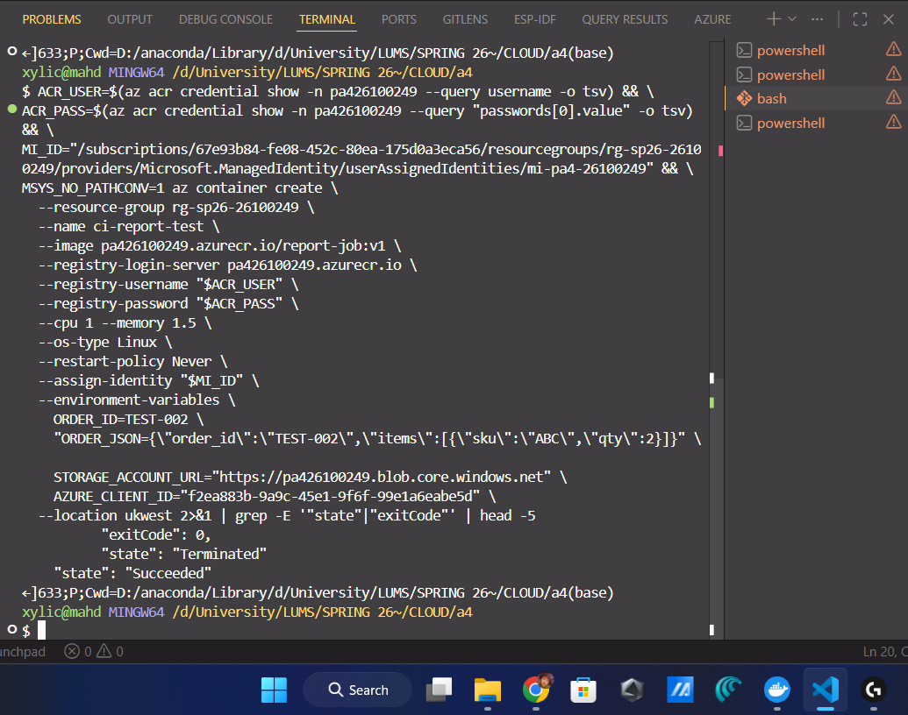
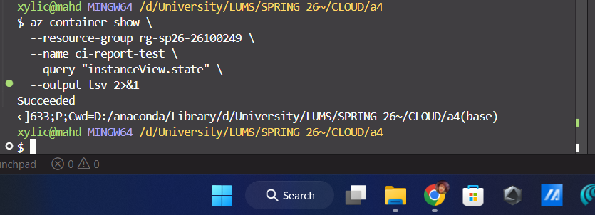

The manual test ACI `ci-report-test` shows a final state of `Succeeded`. The container exits cleanly after the Python script finishes — since `restartPolicy` is set to `Never`, the container group is not restarted and remains in the `Succeeded` terminal state.

### Evidence 6.3: ACI Logs

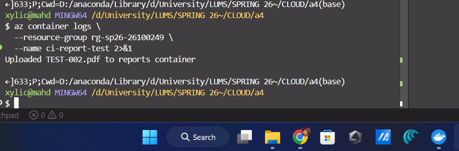

The report job printed `Uploaded TEST-002.pdf to reports container` after generating the PDF with ReportLab and uploading it to the `reports` blob container using `BlobServiceClient` with `ManagedIdentityCredential`. This confirms the full generate-and-upload cycle completed successfully.

### Evidence 6.4: Generated PDF

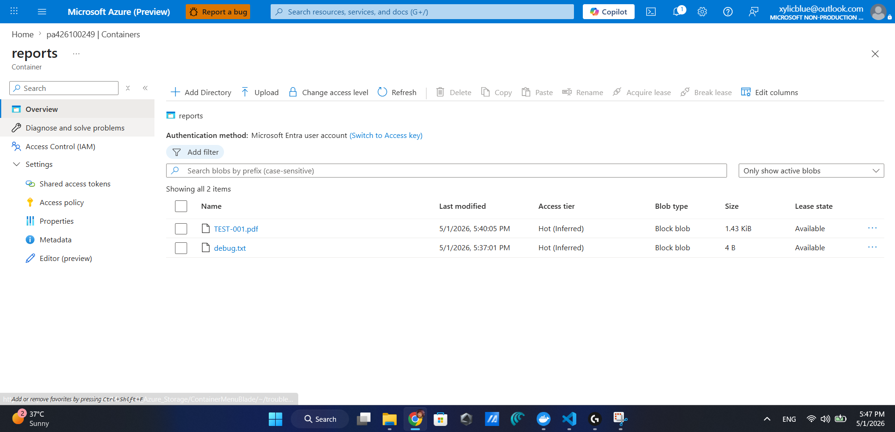

The blob storage container shows `TEST-002.pdf` (and subsequent order PDFs) present, confirming the ACI report job successfully wrote to the storage account. The file was created by the containerized Python script running inside ACI with a User-Assigned Managed Identity that holds Storage Blob Data Owner rights.

### Evidence 6.5: Function App Managed Identity and IAM

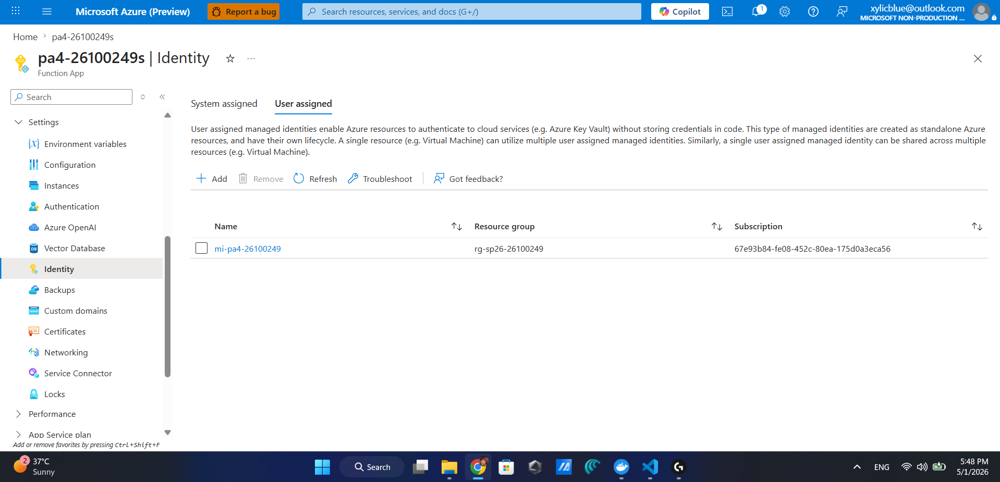

The Function App has the User-Assigned Managed Identity `mi-pa4-26100249` attached. This identity is granted `Contributor` rights at the resource group level, enabling `report_activity` to call the Azure Container Instance Management API and create/delete ACI container groups programmatically without storing any credentials.

### Evidence 6.6: Report App Settings
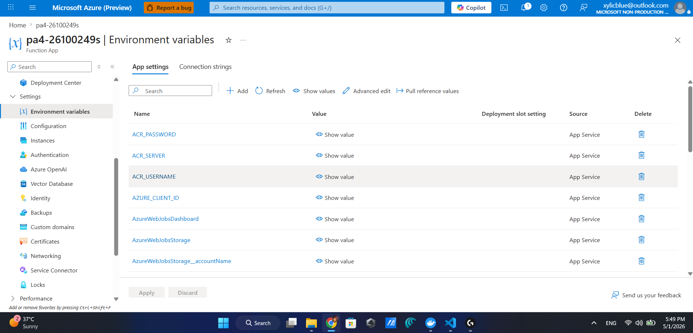
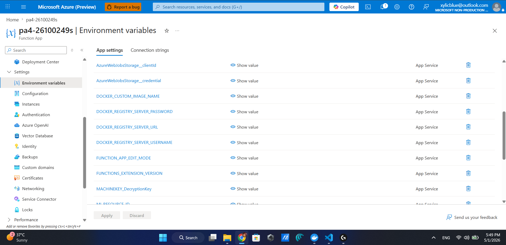
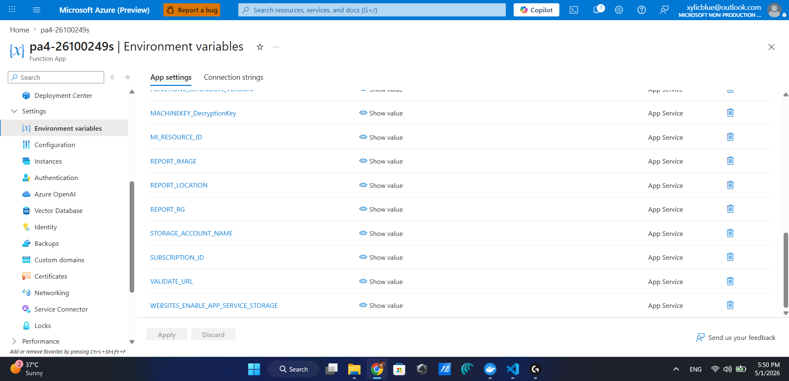

The `REPORT_*` settings (`REPORT_IMAGE`, `REPORT_RG`, `REPORT_LOCATION`) tell `report_activity` which container image to run and where to create the ACI. `ACR_SERVER/USERNAME/PASSWORD` provide registry credentials so ACI can pull the private image. `SUBSCRIPTION_ID` and `MI_RESOURCE_ID` identify the Azure subscription and the Managed Identity to attach to the ACI so it can authenticate to blob storage. `STORAGE_ACCOUNT_NAME` is passed as an environment variable into the ACI container so the report job knows which storage account to upload the PDF to. Secrets are masked.

---

## Task 7: End-to-End Pipeline (15 points)

### Evidence 7.1: Web App Wiring

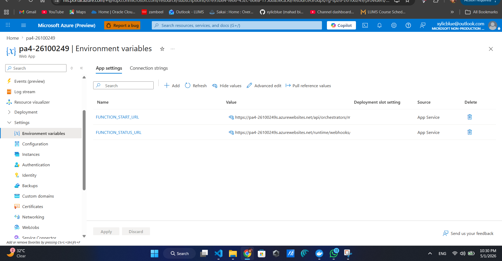

`FUNCTION_START_URL` points to the Durable Function HTTP starter endpoint (with function key). `FUNCTION_STATUS_URL` points to the Durable Task status webhook base URL. The Node.js frontend POSTs to `FUNCTION_START_URL` on order submit and polls `FUNCTION_STATUS_URL/{instanceId}` to display live orchestration status to the user.

### Evidence 7.2: Happy Path UI

### Before Submit:
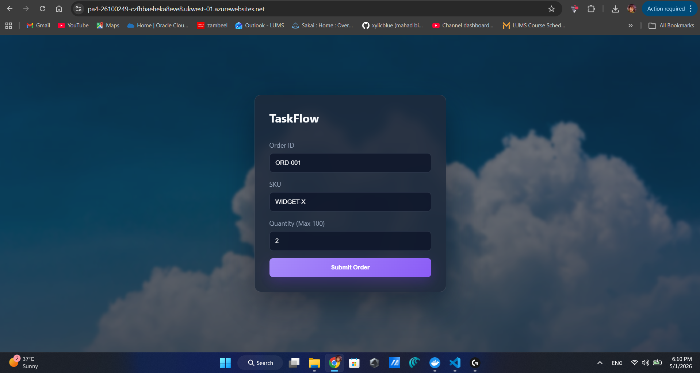

### Running:
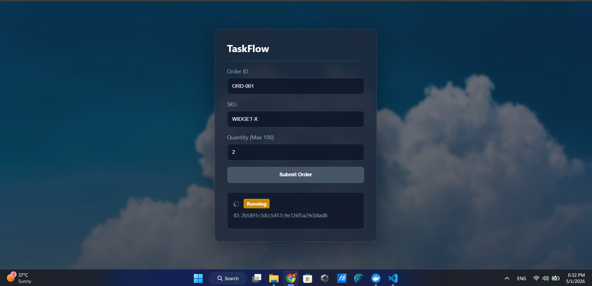

### Finished:
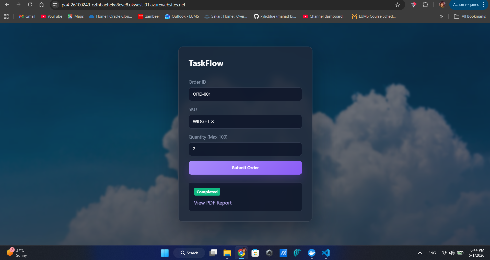

### PDF open:
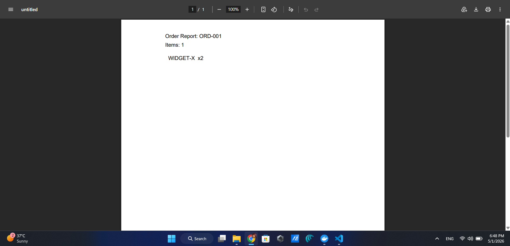

### Order proof as blob (ORD-001):
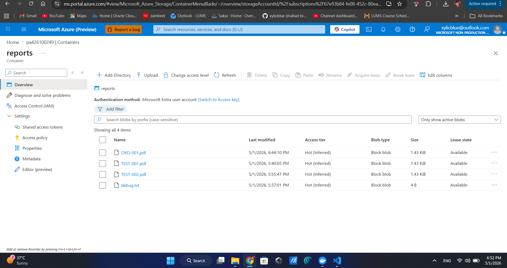

Order `ORD-001` with 1 item (SKU: `WIDGET-A`, qty: 2) was submitted through the Web UI. The orchestration moved from `Running` → `Completed` with `status: completed` and a `report_url` of `https://pa426100249.blob.core.windows.net/reports/ORD-001.pdf`. The PDF was generated and uploaded successfully, visible in the blob container.

### Evidence 7.3: Backend Participation

### ORD-002 (new order):
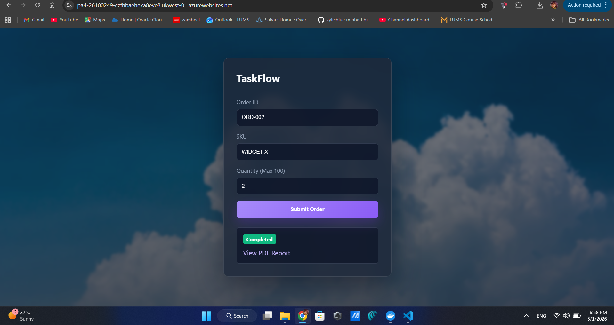

### ACI container proof for ORD-002:
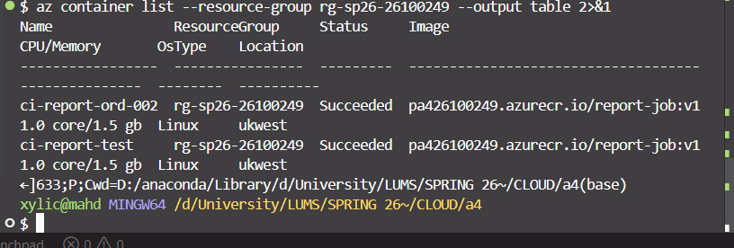

### AKS logs (showing multiple order hits):
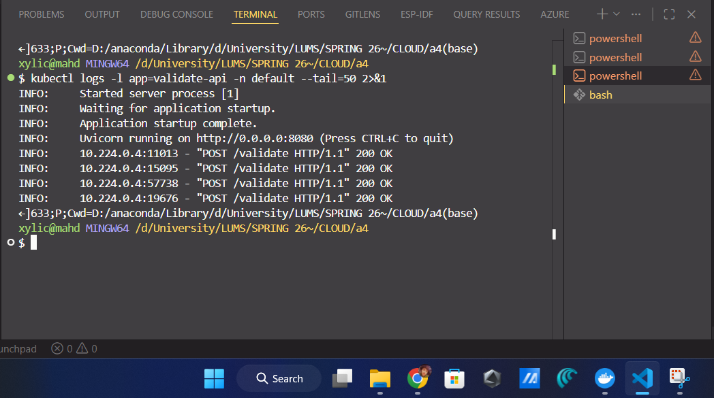

Tracing ORD-002 across all services: the Function App started the orchestration → `validate_activity` called the AKS validator (visible as `POST /validate 200 OK` in the pod logs) → `report_activity` created ACI `ci-report-ord-002` (visible in `az container list`) → the report job uploaded `ORD-002.pdf` to blob storage → the ACI self-deleted after completion. All three backend services participated for every valid order.

### Evidence 7.4: Reject Path UI

### Quantity Exceeded Proof:
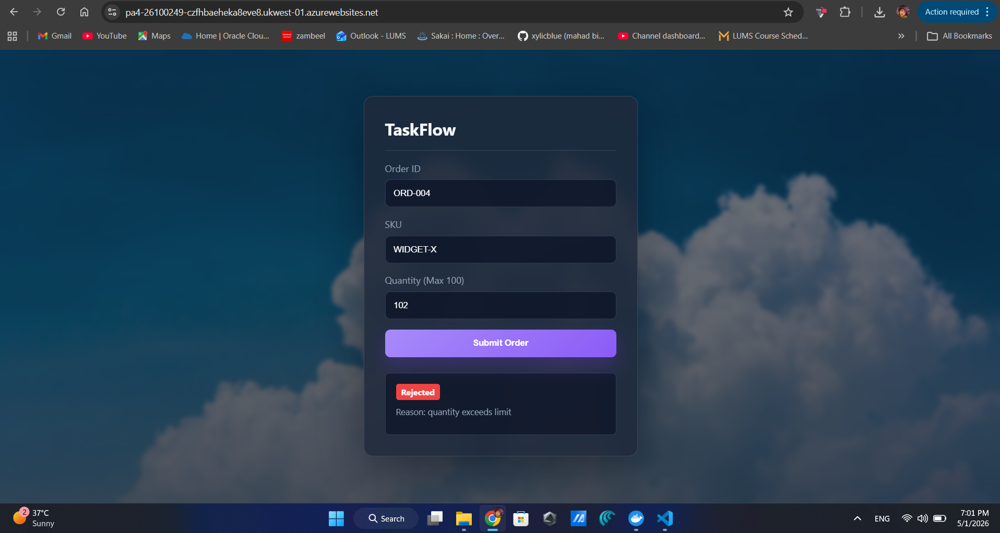

### No new container created for rejected order:
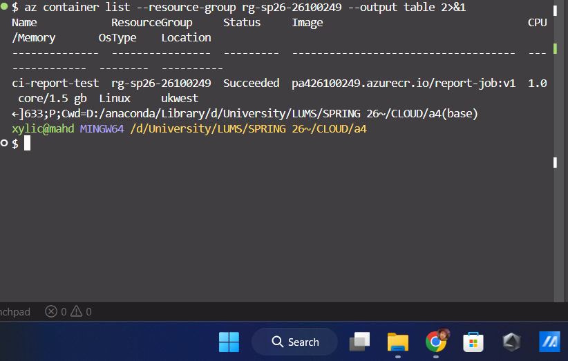

An order with qty=200 was submitted. The AKS validator returned `{"valid": false}` and the orchestrator short-circuited immediately, returning `{"status": "rejected"}` to the UI. No `report_activity` was called, so no ACI was spawned — confirmed by `az container list` showing no `ci-report-*` container for that order.

### Screenshot of all resources in RG:
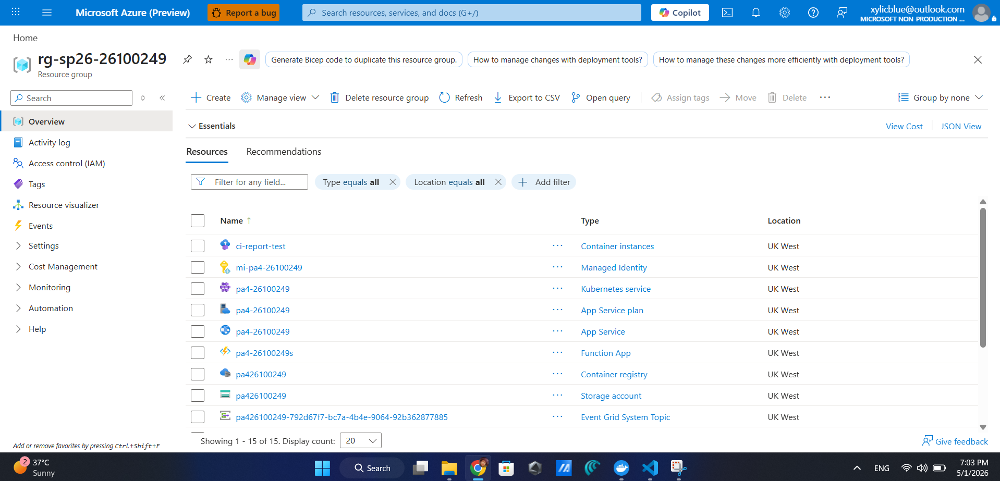

All provisioned resources visible in `rg-sp26-26100249`: App Service, Function App, App Service Plan, AKS cluster, ACR, Storage Account, User-Assigned Managed Identity, and Container Registry.

---

## Task 8: Write-up and Architecture Diagram (5 points)

### Evidence 8.1: Architecture Diagram

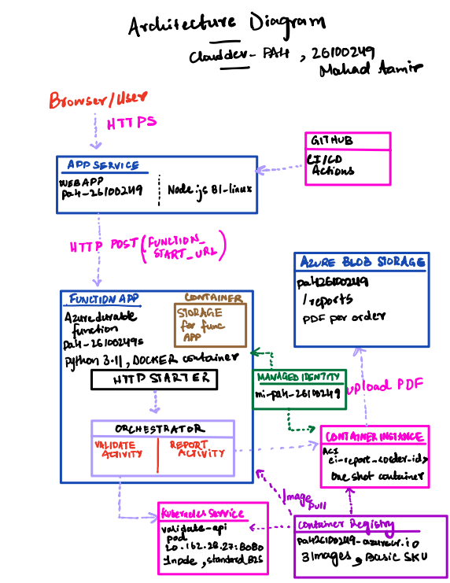

The diagram shows the full request flow: Browser → App Service (Web App) → Azure Durable Functions (HTTP Starter → Orchestrator → validate_activity → report_activity) → AKS (validator microservice) → ACI (one-shot report job) → Azure Blob Storage (reports container). ACR supplies container images to AKS, ACI, and the Function App. The User-Assigned Managed Identity bridges the Function App and ACI to storage without credentials.(PDF FILE IN /DOCS)

### Question 8.2: Service Selection

**App Service** hosts the stateless Node.js frontend because it handles HTTP scaling, TLS, and custom domains out of the box with no container orchestration overhead. A simple web server does not need the complexity of Kubernetes or the cold-start penalty of serverless.

**Durable Functions** manages the multi-step order workflow because it persists orchestration state to storage automatically, provides built-in retry and checkpointing across the validate→report chain, and resumes from the last completed step after any crash or timeout — all without the developer writing any polling or state-machine code.

**AKS** hosts the validator because it is a long-lived, always-on synchronous service that receives frequent calls during order processing. AKS keeps the pod warm with zero cold-start latency, and the LoadBalancer service provides a stable external IP that the Function App can reach directly.

**ACI** handles the one-shot PDF report job because it runs exactly once per order and then exits. ACI bills only for the seconds the container runs, making it cost-efficient for a background task with no idle traffic. Spinning up a dedicated pod in AKS for a job that exits in under a minute would waste a persistent node slot.

### Question 8.3: ACI vs AKS

**Idle behavior:** AKS keeps its node pool running at all times — even with zero orders, the VM incurs a continuous hourly charge. ACI has no idle cost; the container group is created on demand and deleted after completion, so there is zero cost between orders.

**Cost behavior:** AKS cost is dominated by node VM pricing (fixed per hour regardless of load). ACI cost is purely consumption-based — billed per vCPU-second and GB-second of actual container runtime, which is negligible for a sub-60-second report job.

**Operational model:** AKS provides a persistent, stateful deployment with health checks, rolling updates, and horizontal scaling — appropriate for the always-on validator. ACI is ephemeral and disposable — the container is created fresh for each job, removing any state management burden. For the validator, AKS's persistent model ensures sub-second response times; for the report job, ACI's on-demand model eliminates the need to manage a standing deployment.

### Question 8.4: Durable Functions vs Plain HTTP

**Problem 1 — State persistence across crashes:** A plain HTTP call chain has no memory. If the Function App process crashes or times out between the validate call and the ACI report job, the entire order is lost and must be resubmitted manually. Durable Functions checkpoints after every `yield`, so a restart replays only from the last completed activity — the validate result is not re-fetched and the ACI is not double-spawned.

**Problem 2 — Long-running activity coordination:** The report ACI takes 1–3 minutes to complete. A plain HTTP request would hit Azure's 230-second function timeout and fail. Durable Functions externalises the wait — the orchestrator suspends itself (saving state to storage) while `report_activity` polls the ACI, and the orchestration resumes only when the activity returns. The client polls a separate status URL rather than holding a live HTTP connection open.

### Question 8.5: Cost Review

TODO: Embed Cost Management screenshot scoped to your resource group.

The most expensive resource is the AKS node pool (`Standard_B2s` VM running continuously). Unlike ACI or Functions which are consumption-billed, AKS charges for the node VM every hour regardless of whether any orders are processed. The App Service B1 plan (shared between the Web App and Function App) is the second largest cost item.

### Question 8.6: Challenges Faced

**Challenge 1 — Subscription policy blocking shared-key storage access:** The non-production subscription enforced `allowSharedKeyAccess: false` on all storage accounts via Azure Policy, which silently broke both the Durable Functions runtime (which defaults to a connection string for `AzureWebJobsStorage`) and the report job blob upload. The error only surfaced as a `403 AuthorizationFailure` after role assignments were confirmed correct. The fix required switching entirely to Managed Identity authentication: setting `AzureWebJobsStorage__accountName`, `AzureWebJobsStorage__credential=managedidentity`, and `AzureWebJobsStorage__clientId` for the Functions runtime, and rewriting `generate.py` to use `ManagedIdentityCredential` instead of a connection string.

**Challenge 2 — Git Bash silently corrupting Azure resource ID paths:** On Windows with Git Bash, any CLI argument starting with `/subscriptions/` was transparently rewritten to `C:/Program Files/Git/subscriptions/...`. This caused the `MI_RESOURCE_ID` app setting to be stored with the corrupted path, making the ACI creation fail with an invalid resource ID error that looked like an IAM problem. The fix was to prefix all affected `az` commands with `MSYS_NO_PATHCONV=1` to disable Git Bash's POSIX-to-Windows path conversion.

---
